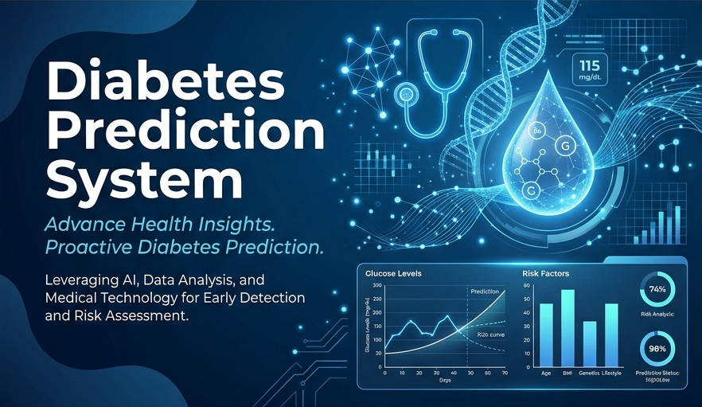

<p align="center">
  
</p>

# 🏥 Diabetes Prediction System


**Diabetes Prediction System** is a robust machine learning application designed to provide early diagnostic insights. By utilizing a **Support Vector Machine (SVM)** model trained on the PIMA Diabetes Dataset, this tool allows users to input health metrics and receive an instant prediction regarding their diabetic status with high reliability.

---

## 🚀 View Live Site

The project is live and accessible online.

[](https://diabetes-prediction-system-945.streamlit.app/)

---

## ✨ Key Features

- **📊 Intelligent Data Analysis**: Analyzes complex medical parameters like Glucose levels, BMI, and Insulin to find patterns linked to diabetes.
- **💡 Instant Diagnosis**: Provides real-time feedback based on the trained model's high-precision classification.
- **📱 Responsive UI**: A sleek, modern Streamlit interface optimized for both desktop and mobile devices.
- **🛠️ Reliable ML Engine**: Powered by a finely-tuned Support Vector Machine (SVM) algorithm for robust binary classification.
- **⚕️ User-Centric Design**: Includes medical icons and helpful placeholders to guide users through the health metric input process.
- **🐳 Containerized**: Fully containerized using Docker for consistent, reproducible environments.
- **🔄 CI/CD Ready**: Integrated with GitHub Actions to automate building and pushing the Docker image to Docker Hub.

---

## 🧠 Technical Workflow

1. **Input Pipeline**: User enters 8 medical parameters (Pregnancies, Glucose, Blood Pressure, etc.) into the Streamlit interface.
2. **Model Inference**: The input data is processed by the saved `trained_model.sav` (SVM Classifier).
3. **Result Visualisation**: The system interprets the binary output (0 or 1) and displays a success/error message with clinical context.

---

## 🛠️ Tech Stack

- **Language**: [Python 3.x](https://www.python.org/)
- **Frontend**: [Streamlit](https://streamlit.io/)
- **ML Libraries**: [Scikit-Learn](https://scikit-learn.org/), [NumPy](https://numpy.org/)
- **Data Handling**: [Pandas](https://pandas.pydata.org/)
- **Model Serialization**: [Pickle](https://docs.python.org/3/library/pickle.html)
- **Containerization**: [Docker](https://www.docker.com/)
- **CI/CD**: [GitHub Actions](https://github.com/features/actions)

---

## ⚙️ Installation & Setup

### 1. Clone & Navigate

```bash
git clone https://github.com/ajaygangwar945/Diabetes-Prediction-System.git
cd Diabetes-Prediction-System
```

### 2. Environment Setup

```bash
python -m venv venv
# Windows
venv\Scripts\activate
# macOS/Linux
source venv/bin/activate
```

### 3. Install Dependencies

```bash
pip install -r requirements.txt
```

### 4. Run Locally

```bash
streamlit run Diabetes-Prediction-System.py
```

### 5. Run with Docker (Alternative)

If you have Docker installed, you can build and run the application in a container without installing local dependencies.

```bash
# Build the Docker image
docker build -t diabetes-prediction-system .

# Run the container
docker run -p 8501:8501 diabetes-prediction-system
```

---

## 📁 File Structure

```text
Diabetes-Prediction-System/
├── .github/workflows/docker.yaml    # GitHub Actions Build & Push Workflow
├── .elasticbeanstalk/               # AWS Elastic Beanstalk Configuration
├── Diabetes-Prediction-System.py    # Main Streamlit Application
├── trained_model.sav                # Saved SVM Classifier Model
├── Diabetes-Prediction-System.csv   # PIMA Diabetes Dataset
├── Diabetes-Prediction-System.ipynb # Jupyter Notebook (Training & Analysis)
├── Dockerfile                       # Docker Image Instructions
├── PROJECT_DETAILS.txt              # Detailed Technical Documentation
├── requirements.txt                 # Project Dependencies
├── README.md                        # Visual Overview & Guide
├── .gitignore                       # Git exclusion file
├── .dockerignore                    # Docker exclusion file
└── banner.png                       # Dashboard Branding Asset
```

---

## 🚀 Deployment

This app is optimized for **Streamlit Cloud**.

1. Push your code to GitHub.
2. Connect your repo to [Streamlit Share](https://share.streamlit.io/).
3. Ensure `requirements.txt` is present for automatic dependency installation.

---

## 👨‍💻 Author

**Ajay Gangwar**

- GitHub: [@ajaygangwar945](https://github.com/ajaygangwar945)
- Project Link: [Diabetes Prediction System](https://github.com/ajaygangwar945/Diabetes-Prediction-System)

---
*Disclaimer: This tool is for educational purposes only and should not be used as a substitute for professional medical advice.*
